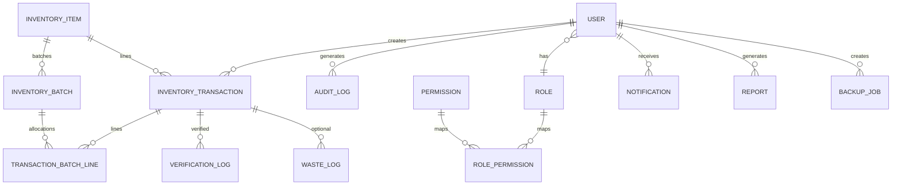

# ERD — E-Inventory System MBG

Diagram relasi utama (PostgreSQL + Prisma).

## Catatan FIFO

- Stok fisik di `inventory_batches.remaining_quantity`, diurutkan `received_at` untuk konsumsi keluar.
- Transaksi **keluar** (pemakaian / waste) membuat `transaction_batch_line` saat **approve**, setelah itu batch terupdate.
- Transaksi **masuk** membuat batch baru saat **approve**.
